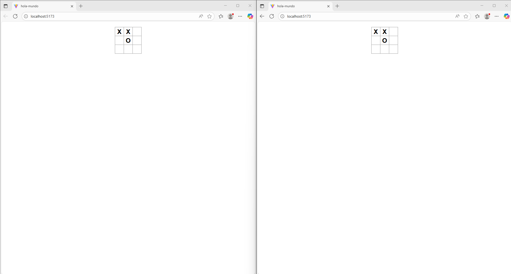

## A partir de este Juego construya una aplicación interactiva usando WebSockets que permita:

1. Crear una sala

Primero se crea el modelo de la sala que se va a guardar en alguna base de datos

```java
package com.tictactoe.core.model;

import java.util.ArrayList;
import java.util.List;

import org.springframework.data.annotation.Id;
import org.springframework.data.mongodb.core.mapping.Document;

@Document(collection = "Rooms")
public class Room {

    @Id
    private String id;
    private List<String> players;
    private List<String> gameHistory;
    private List<List<String>> board;

    public Room(String id) {
        this.id = id;
        this.players = new ArrayList<>();
        this.gameHistory = new ArrayList<>();
    }
    // ...
    // getters and setters 
}
```

Para persistir las salas se crea el repositorio, en este caso usando MongoDB porque no se debe persistir mucha información.

```java
package com.tictactoe.core.Repo.RoomsRepository;

import org.springframework.data.mongodb.repository.MongoRepository;

import com.tictactoe.core.model.Room;

public interface RoomRepository extends MongoRepository<Room, String> {
    
}
```
Luego se crea el controlador que maneja la lógica de las salas

```java
@Controller
public class RoomController {

    @Autowired
    private RoomRepository roomRepository;

    @MessageMapping("/createRoom")
    @SendTo("/topic/rooms")
    public Room createRoom(String roomId) {
        Room room = new Room();
        room.setId(roomId);
        room.setBoard(new ArrayList<>(List.of(
            new ArrayList<>(List.of(null, null, null)),
            new ArrayList<>(List.of(null, null, null)),
            new ArrayList<>(List.of(null, null, null))
        )));
        roomRepository.save(room);
        return room;
    }

    @MessageMapping("/joinRoom")
    @SendTo("/topic/rooms")
    public Room joinRoom(String roomId, String playerId) {
        Room room = roomRepository.findById(roomId).get();
        if (room != null && room.getPlayers().size() < 2) {
            room.getPlayers().add(playerId);
            roomRepository.save(room);
        }
        return room;
    }

    @MessageMapping("/makeMove")
    @SendTo("/topic/game")
    public Room makeMove(String roomId, int row, int col, String player) {
        Room room = roomRepository.findById(roomId).get();
        if (room != null) {
            List<List<String>> board = room.getBoard();
            board.get(row).set(col, player);
            room.getHistory().add(new ArrayList<>(board));
            roomRepository.save(room);
        }
        return room;
    }
}
```

### FRONT

En el front se crea la conexión WebSocket y se manejan los eventos para crear la sala, unirse a la sala y hacer movimientos.

```ts
import SockJS from 'sockjs-client';
import { Stomp } from '@stomp/stompjs';

const socket = new SockJS('http://localhost:8080/ws');
console.log('Socket initialized:', socket);
const stompClient = Stomp.over(socket);

export function connectToRoom(roomName, onMessageReceived) {
  stompClient.connect({}, () => {
    stompClient.subscribe(`/topic/rooms/${roomName}`, (message) => {
      const parsedMessage = JSON.parse(message.body);
      onMessageReceived(parsedMessage);
    });

    stompClient.send('/app/createRoom', {}, roomName);
  });
}

export function sendMessageToRoom(roomName, message) {
  stompClient.send(`/app/rooms/${roomName}`, {}, JSON.stringify(message));
}

```

Luego se crea un boton de tipo input para crear la sala y unirse a la sala

```tsx
<div>
      {!connected && (
        <div>
          <input
            type="text"
            placeholder="Enter room name"
            value={roomName}
            onChange={(e) => setRoomName(e.target.value)}
          />
          <button onClick={handleRoomConnect}>Connect to Room</button>
        </div>
      )}
</div>
```	

Para transferir el movimiento, se envía al servidor el mo

```jsx
async function makeMove(row, col) {
    if (!connected || winner) return;

    const player = xIsNext ? "X" : "O";
    const nextSquares = squares.slice();
    const index = row * 3 + col;

    if (nextSquares[index]) return;

    nextSquares[index] = player;
    setSquares(nextSquares);
    setXIsNext(!xIsNext);

    await sendMessageToRoom(roomName, { squares: nextSquares, xIsNext: !xIsNext });
  }
  function handleClick(i) {
    if (squares[i] || winner || !connected) return;
    const nextSquares = squares.slice();
    nextSquares[i] = xIsNext ? "X" : "O";
    setSquares(nextSquares);
    setXIsNext(!xIsNext);

    sendMessageToRoom(roomName, { squares: nextSquares, xIsNext: !xIsNext });
  }
  ```

De esta manera se puede construir una aplicación interactiva de Tic Tac Toe usando WebSockets para la comunicación en tiempo real entre los jugadores.





repositorio front:

https://github.com/DSBAENAR/LearningReact.git

